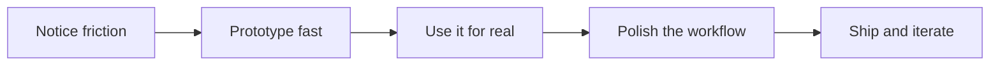

<div align="center">

# Gjj

**Vibe Coding** · useful browser extensions · automation tools · small product experiments

[](https://github.com/ryohgicc?tab=followers)
[](https://github.com/ryohgicc?tab=stars)

</div>

```txt
ryohgicc@github
├─ mode: vibe coding
├─ ships: browser extensions, macOS utilities, automation helpers
├─ taste: small UI, direct workflows, useful defaults
└─ current loop: idea -> prototype -> polish -> publish
```

### What I Build

| Direction | Shape |
| --- | --- |
| Browser extensions | Capture, transform, and share web content with fewer clicks |
| AI workflows | Make LLMs useful inside everyday product flows |
| Automation tools | Turn repeated tiny tasks into one reliable action |
| Small apps | Focused utilities with clear interfaces and fast feedback |

### Toolbox


### Build Loop



### Selected Projects

| Project | What it does |
| --- | --- |
| [ShareCraft](https://github.com/ryohgicc/ShareCraft) | Turns webpages into share-ready recommendation copy with your own LLM API key. |
| [xhs2reddit](https://github.com/ryohgicc/xhs2reddit) | Extracts Xiaohongshu note content, including title, body text, and images. |
| [habittrack](https://github.com/ryohgicc/habittrack) | A TypeScript habit tracking project. |
| [muti_language_translation](https://github.com/ryohgicc/muti_language_translation) | Local multilingual translation across 12 languages. |

### Snapshot

| Public repos | Stars earned | Followers | Main languages |
| ---: | ---: | ---: | --- |
| 20 | 38 | 7 | JavaScript, Swift, HTML, TypeScript, Python |

### Recent Activity

<!--RECENT_ACTIVITY:start-->
- Updated [ryohgicc/Ryohgicc](https://github.com/ryohgicc/Ryohgicc)
- Created something in [ryohgicc/ScreenGuard](https://github.com/ryohgicc/ScreenGuard)
- Pushed updates to [ryohgicc/ScreenshotTodo](https://github.com/ryohgicc/ScreenshotTodo)
- Pushed updates to [ryohgicc/Billiards-ELO-Rating-System](https://github.com/ryohgicc/Billiards-ELO-Rating-System)
- Pushed updates to [ryohgicc/Billiards-ELO-Rating-System](https://github.com/ryohgicc/Billiards-ELO-Rating-System)
<!--RECENT_ACTIVITY:end-->

<!--
To personalize this profile, edit profile.config.json and run:

  node scripts/update-profile.mjs

Then commit README.md, profile.config.json, scripts/update-profile.mjs, and .github/workflows/update-profile.yml
to a repository named exactly the same as your GitHub username.
-->
